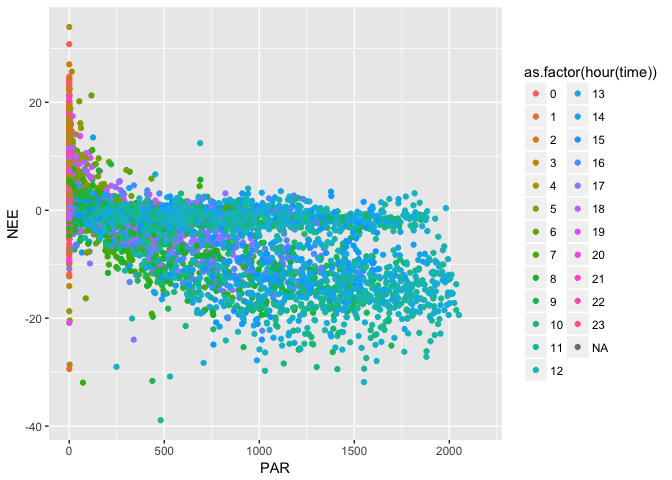

# First Principles: Example
Michael Dietze  

Modifications by Owen Petchey.


To illustrate the application of the analytical concepts above, conside a simple example of fitting a dynamic linear model to Net Ecosystem Exchange (NEE) data from an eddy covariance tower, and then using that model to make a short-term forecast. Training data were downloaded for the Sylvania Wilderness Ameriflux tower for 2016 from Ankur Desai's real-time data server (http://flux.aos.wisc.edu/twiki/bin/view/Main/LabData). Sylvania is an old-growth Northern Hardwood-Hemlock forest located in upper peninsula Michigan (46.242,-89.3476). For purposes of model calibration the most recent 16 days of data were used.


```
## Warning: Removed 11 rows containing missing values (geom_path).
```

```
## Warning: Removed 8530 rows containing missing values (geom_point).
```

<!-- -->

```
## Warning: Removed 8530 rows containing non-finite values (stat_density).
```

```
## Warning in (function (data, mapping, alignPercent = 0.6, method =
## "pearson", : Removed 8530 rows containing missing values
```

```
## Warning in (function (data, mapping, alignPercent = 0.6, method =
## "pearson", : Removed 8530 rows containing missing values
```

```
## Warning in (function (data, mapping, alignPercent = 0.6, method =
## "pearson", : Removed 8530 rows containing missing values
```

```
## Warning in (function (data, mapping, alignPercent = 0.6, method =
## "pearson", : Removed 8530 rows containing missing values
```

```
## Warning in (function (data, mapping, alignPercent = 0.6, method =
## "pearson", : Removed 8530 rows containing missing values
```

```
## Warning in (function (data, mapping, alignPercent = 0.6, method =
## "pearson", : Removed 8552 rows containing missing values
```

```
## Warning in (function (data, mapping, alignPercent = 0.6, method =
## "pearson", : Removed 8530 rows containing missing values
```

```
## Warning in (function (data, mapping, alignPercent = 0.6, method =
## "pearson", : Removed 8530 rows containing missing values
```

```
## Warning in (function (data, mapping, alignPercent = 0.6, method =
## "pearson", : Removed 8530 rows containing missing values
```

```
## Warning: Removed 8530 rows containing missing values (geom_point).
```

```
## Warning: Removed 142 rows containing non-finite values (stat_density).
```

```
## Warning in (function (data, mapping, alignPercent = 0.6, method =
## "pearson", : Removed 143 rows containing missing values
```

```
## Warning in (function (data, mapping, alignPercent = 0.6, method =
## "pearson", : Removed 143 rows containing missing values
```

```
## Warning in (function (data, mapping, alignPercent = 0.6, method =
## "pearson", : Removed 143 rows containing missing values
```

```
## Warning in (function (data, mapping, alignPercent = 0.6, method =
## "pearson", : Removed 142 rows containing missing values
```

```
## Warning in (function (data, mapping, alignPercent = 0.6, method =
## "pearson", : Removed 1364 rows containing missing values
```

```
## Warning in (function (data, mapping, alignPercent = 0.6, method =
## "pearson", : Removed 143 rows containing missing values
```

```
## Warning in (function (data, mapping, alignPercent = 0.6, method =
## "pearson", : Removed 143 rows containing missing values
```

```
## Warning in (function (data, mapping, alignPercent = 0.6, method =
## "pearson", : Removed 143 rows containing missing values
```

```
## Warning: Removed 8530 rows containing missing values (geom_point).
```

```
## Warning: Removed 143 rows containing missing values (geom_point).
```

```
## Warning: Removed 143 rows containing non-finite values (stat_density).
```

```
## Warning in (function (data, mapping, alignPercent = 0.6, method =
## "pearson", : Removed 143 rows containing missing values
```

```
## Warning in (function (data, mapping, alignPercent = 0.6, method =
## "pearson", : Removed 143 rows containing missing values
```

```
## Warning in (function (data, mapping, alignPercent = 0.6, method =
## "pearson", : Removed 143 rows containing missing values
```

```
## Warning in (function (data, mapping, alignPercent = 0.6, method =
## "pearson", : Removed 1365 rows containing missing values
```

```
## Warning in (function (data, mapping, alignPercent = 0.6, method =
## "pearson", : Removed 143 rows containing missing values
```

```
## Warning in (function (data, mapping, alignPercent = 0.6, method =
## "pearson", : Removed 143 rows containing missing values
```

```
## Warning in (function (data, mapping, alignPercent = 0.6, method =
## "pearson", : Removed 143 rows containing missing values
```

```
## Warning: Removed 8530 rows containing missing values (geom_point).
```

```
## Warning: Removed 143 rows containing missing values (geom_point).

## Warning: Removed 143 rows containing missing values (geom_point).
```

```
## Warning: Removed 143 rows containing non-finite values (stat_density).
```

```
## Warning in (function (data, mapping, alignPercent = 0.6, method =
## "pearson", : Removed 143 rows containing missing values
```

```
## Warning in (function (data, mapping, alignPercent = 0.6, method =
## "pearson", : Removed 143 rows containing missing values
```

```
## Warning in (function (data, mapping, alignPercent = 0.6, method =
## "pearson", : Removed 1365 rows containing missing values
```

```
## Warning in (function (data, mapping, alignPercent = 0.6, method =
## "pearson", : Removed 143 rows containing missing values
```

```
## Warning in (function (data, mapping, alignPercent = 0.6, method =
## "pearson", : Removed 143 rows containing missing values
```

```
## Warning in (function (data, mapping, alignPercent = 0.6, method =
## "pearson", : Removed 143 rows containing missing values
```

```
## Warning: Removed 8530 rows containing missing values (geom_point).
```

```
## Warning: Removed 143 rows containing missing values (geom_point).

## Warning: Removed 143 rows containing missing values (geom_point).

## Warning: Removed 143 rows containing missing values (geom_point).
```

```
## Warning: Removed 143 rows containing non-finite values (stat_density).
```

```
## Warning in (function (data, mapping, alignPercent = 0.6, method =
## "pearson", : Removed 143 rows containing missing values
```

```
## Warning in (function (data, mapping, alignPercent = 0.6, method =
## "pearson", : Removed 1365 rows containing missing values
```

```
## Warning in (function (data, mapping, alignPercent = 0.6, method =
## "pearson", : Removed 143 rows containing missing values
```

```
## Warning in (function (data, mapping, alignPercent = 0.6, method =
## "pearson", : Removed 143 rows containing missing values
```

```
## Warning in (function (data, mapping, alignPercent = 0.6, method =
## "pearson", : Removed 143 rows containing missing values
```

```
## Warning: Removed 8530 rows containing missing values (geom_point).
```

```
## Warning: Removed 142 rows containing missing values (geom_point).
```

```
## Warning: Removed 143 rows containing missing values (geom_point).

## Warning: Removed 143 rows containing missing values (geom_point).

## Warning: Removed 143 rows containing missing values (geom_point).
```

```
## Warning: Removed 142 rows containing non-finite values (stat_density).
```

```
## Warning in (function (data, mapping, alignPercent = 0.6, method =
## "pearson", : Removed 1364 rows containing missing values
```

```
## Warning in (function (data, mapping, alignPercent = 0.6, method =
## "pearson", : Removed 143 rows containing missing values
```

```
## Warning in (function (data, mapping, alignPercent = 0.6, method =
## "pearson", : Removed 143 rows containing missing values
```

```
## Warning in (function (data, mapping, alignPercent = 0.6, method =
## "pearson", : Removed 143 rows containing missing values
```

```
## Warning: Removed 8552 rows containing missing values (geom_point).
```

```
## Warning: Removed 1364 rows containing missing values (geom_point).
```

```
## Warning: Removed 1365 rows containing missing values (geom_point).

## Warning: Removed 1365 rows containing missing values (geom_point).

## Warning: Removed 1365 rows containing missing values (geom_point).
```

```
## Warning: Removed 1364 rows containing missing values (geom_point).
```

```
## Warning: Removed 1364 rows containing non-finite values (stat_density).
```

```
## Warning in (function (data, mapping, alignPercent = 0.6, method =
## "pearson", : Removed 1365 rows containing missing values
```

```
## Warning in (function (data, mapping, alignPercent = 0.6, method =
## "pearson", : Removed 1365 rows containing missing values
```

```
## Warning in (function (data, mapping, alignPercent = 0.6, method =
## "pearson", : Removed 1365 rows containing missing values
```

```
## Warning: Removed 8530 rows containing missing values (geom_point).
```

```
## Warning: Removed 143 rows containing missing values (geom_point).

## Warning: Removed 143 rows containing missing values (geom_point).

## Warning: Removed 143 rows containing missing values (geom_point).

## Warning: Removed 143 rows containing missing values (geom_point).

## Warning: Removed 143 rows containing missing values (geom_point).
```

```
## Warning: Removed 1365 rows containing missing values (geom_point).
```

```
## Warning: Removed 143 rows containing non-finite values (stat_density).
```

```
## Warning in (function (data, mapping, alignPercent = 0.6, method =
## "pearson", : Removed 143 rows containing missing values
```

```
## Warning in (function (data, mapping, alignPercent = 0.6, method =
## "pearson", : Removed 143 rows containing missing values
```

```
## Warning: Removed 8530 rows containing missing values (geom_point).
```

```
## Warning: Removed 143 rows containing missing values (geom_point).

## Warning: Removed 143 rows containing missing values (geom_point).

## Warning: Removed 143 rows containing missing values (geom_point).

## Warning: Removed 143 rows containing missing values (geom_point).

## Warning: Removed 143 rows containing missing values (geom_point).
```

```
## Warning: Removed 1365 rows containing missing values (geom_point).
```

```
## Warning: Removed 143 rows containing missing values (geom_point).
```

```
## Warning: Removed 143 rows containing non-finite values (stat_density).
```

```
## Warning in (function (data, mapping, alignPercent = 0.6, method =
## "pearson", : Removed 143 rows containing missing values
```

```
## Warning: Removed 8530 rows containing missing values (geom_point).
```

```
## Warning: Removed 143 rows containing missing values (geom_point).

## Warning: Removed 143 rows containing missing values (geom_point).

## Warning: Removed 143 rows containing missing values (geom_point).

## Warning: Removed 143 rows containing missing values (geom_point).

## Warning: Removed 143 rows containing missing values (geom_point).
```

```
## Warning: Removed 1365 rows containing missing values (geom_point).
```

```
## Warning: Removed 143 rows containing missing values (geom_point).

## Warning: Removed 143 rows containing missing values (geom_point).
```

```
## Warning: Removed 143 rows containing non-finite values (stat_density).
```

<!-- -->

```
## Warning: Removed 8530 rows containing missing values (geom_point).
```

<!-- -->

```
## Warning: Removed 11 rows containing missing values (geom_path).
```

```
## Warning: Removed 8530 rows containing missing values (geom_point).
```

```
## Warning: Removed 420 rows containing missing values (geom_point).
```

<!-- -->


```
## Warning: Removed 1 rows containing missing values (geom_path).
```

```
## Warning: Removed 420 rows containing missing values (geom_point).
```

<!-- --><!-- -->

```
## Warning: Removed 1 rows containing missing values (geom_path).

## Warning: Removed 420 rows containing missing values (geom_point).
```

<!-- --><!-- --><!-- -->

**Figure XX** Dynamical linear model median (solid line) and 95% CI (shaded area) fit to observed flux data (+). 

The dynamic linear model was fit using top-of-tower air temperature (Ta) and photosythetically active radiation (PAR) as covariates. The model was fit in a state-space framework where $NEE_o$ is the observed NEE values, $NEE$ is the latent (unobserved) true value of NEE, $\tau_o$ is the observation error, $\tau_p$ is the process error, and $\beta$ are the regression coefficients

$$NEE_{t+1} \sim N(\beta_0 NEE_t + \beta_1 + \beta_2 Ta + \beta_3 PAR, \tau_p$$
$$NEE_{o,t} \sim N(NEE_{t},\tau_o)$$

Model fits and forecasts were performed in R (version 3.3.2, CITE) using the
ecoforecastR R package (version 0.1.0, available on Github at https://github.com/EcoForecast/ecoforecastR) and JAGS (CITE). Uninformative Normal priors (mean 0, precision 0.001) were assumed for the $\beta$s and uninformative Gamma(0.1,0.1) priors were assumed for the precisions.

The fit itself shows that this simple linear model with two covariates can capture the diurnal cycle of the flux data, though with condiderable uncertainty during periods of missing data. Following the standard atmospheric sign convention for NEE data (negative values are uptake into the ecosystem), we observe large negative uptakes of carbon during the day and moderate positive losses at night. In terms of exogenous sensitivity, this cycle is driven primarily by the the expected negative slope for PAR, with a CI that does not overlap with zero. Air temperature likewise shows a negative relationship, but this slope does overlap zero. In terms of endogenous stability, the slope of the internal stability term is large (0.7392757), though stable (less than 1) with a CI that was far from 0, thus indicating significant system memory in NEE. In terms of the error terms, the observation error had much higher precision (lower variance), than the process error, suggesting that much of the observed NEE variability represents real variation that the simple model is not capturing. This conclusion is somewhat at odds with the standard literature in the flux community, which acknowledges substantial observation errors in fluxes (CITE). The present analysis is purely for proof-of-concept purposes, and a more in depth analysis could be improved in a number of specific ways. First, while there is some debate on the exact shape of the flux error funciton (CITE), a number of researchers have suggested that a fat-tailed Laplace distribution is more appropriate for eddy-covariance than a Normal. Second, there is general agreement that eddy-covariance data is heteroskedastic (the error increases with the magnitude of the flux) and that this heteroskedasticity is asymmetric (negative fluxes have lower error than postive fluxes, as the nighttime conditions associated with respiration face stiller air and more advective losses). Third, established methods for quantifying the random error in eddy-covariance could be used to construct informative priors on the observation error. Indeed, such estimates now often come with FLUXNET and NEON flux products (CITE). Finally, it is well known that separating process and observation error can be challenging in state-space models, and thus a general suggestion is that any more in depth analysis on any data, not just eddy-covariance, pay close attention to observation error and make use of informative priors wherever they can be inferred.  Nonetheless, this model, in its extreme simplicity, represents a useful baseline for evaluating the performance of any nonlinear statistical or process-based model.


```r
knitr::kable(cbind(cal.parms$statistics[,1:2],cal.parms$quantiles[,c(1,5)]))
```

                       Mean          SD         2.5%        97.5%
--------------  -----------  ----------  -----------  -----------
betaIntercept    -0.0033014   0.0591974   -0.1193678    0.1127455
betaPAR          -0.0004586   0.0002356   -0.0009182   -0.0000009
betaTA           -0.0001803   0.0048342   -0.0096177    0.0093096
beta_IC           0.7392757   0.0536660    0.6603698    0.8172034
tau_add           1.5289735   0.2107332    1.2064121    2.0297485
tau_obs          14.8201756   9.2722393    4.2830708   38.6800021

**Table XX** Posterior mean, standard deviation, and 95% CI for fit parameters


The NEE was then forecast for the next 16 days using the fit model and weather forecast data from NOAA's Global Ensemble Forecast System (GEFS), which was downloaded using the rNOAA package ((version 0.6.6). Driver uncertainty was captured by the spread of the 21 members of the ensemble forecast. Air temperature data was downscaled to 30 min by fitting a spline through the six-hourly forecast product. The PAR forecast represents a six-hour average, so this was downscaled to 30 min in proportion to an expected incident radiation based on solar geometry. This approach is equivalent to assuming a constant cloudiness for each six-hour period.


Forecasts were made using a 500 member ensemble, with each ensemble member sampling a set of drivers with replacement from the forecast ensemble. Similarly, parameters and initial conditions were sampled from the state-space posterior estimates, with the initial condition estimate being the final NEE state estimate from the calibration period.

The uncertainty in model predictions was partitioned using two different approaches. The first generated using the analytical approximation discussed previously. The second was generated by running a series of forecasts that included different sources of uncertainty, and estimating the effect of a process as the difference in variance between pairs of scenarios. Specifically, we started with just Initial Condition uncertainty and then sequentially added parameter uncertainty, driver uncertainty, and then process uncertainty. The results of these two approaches were qualitatively similar but differ slightly because of the sequential nature of the second approach, and because it accounts for the additional interactions and non-linearities not in the linear approximation. These results are summarized in terms of time series plots of the relative proportion of variance attributable to each term.


TO-DO:

* clean up
* write text
* To be consistent with main text, should have random effects, model error should be AR1

## APPENDIX


